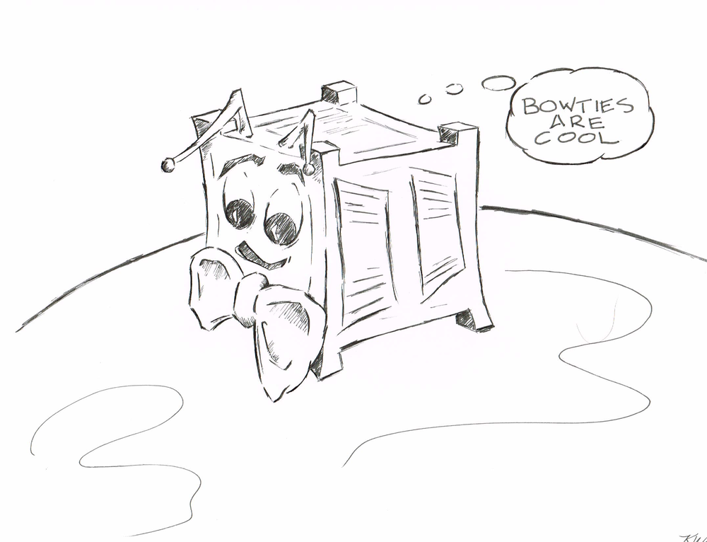
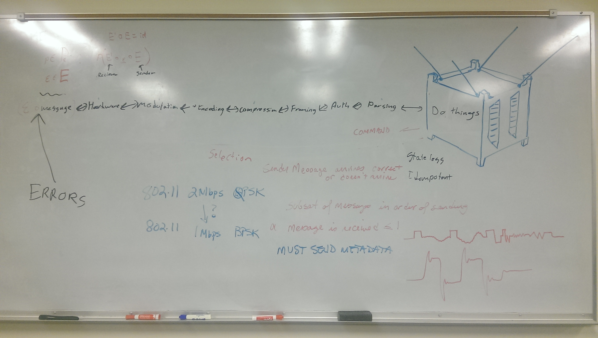
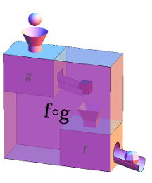

\pagebreak

 

# tl;dr: **A Cubesat Does Stuff**

## Notes from whiteboard discussion at PSAS meeting about communications system for CS0

This discussion alternated between current ideas and blue-sky ambitions for developing the firmware for the communications system for CS0.

\pagebreak

# Cubesat definition
For the purposes of this discussion a Cubesat is a thing that *does things*. There must exist a method to communicate with the Cubesat:

* What it is to do
* What it did
* Any results of what it did

\pagebreak

# Two views of the PSAS Cubesat Communication System

## Physical View (hardware)
The physical view (a.k.a. **"The Radio"**) is a set a hardware to move information from some physical point A to some physical point B. In the physical view this information moves across a *channel*. 

 

<!--\footnote{Juanita Demchak,license: https://creativecommons.org/licenses/by-nc-nd/2.0/legalcode}-->
<!--\footnote{https://www.flickr.com/photos/29245240@N02/9923429004/in/photolist-g7UaHw-g7TSBt}-->

## Computational View (software)
The computational view (a.k.a. **"The Bitsadajig"**) is a set of composed functions. These functions define a datapath across the physical communications channel. 

\begin{equation} 
 \vec{E}=f(a) \circ f(b) \circ f(c) \ldots \circ f(n)
\end{equation}

 

<!--\footnote{"Function machines composed and combined into a new function machine.” From Math Insight. http://mathinsight.org/image/function\_machines\_composed\_combined}-->
<!--\footnote{https://creativecommons.org/licenses/by-nc-sa/4.0/}-->

\vfill

\pagebreak

# Design Principles of the Cubesat Communication System
A goal presented was to develop the system in a way that allows us to explore behavior and error models ahead of hardware availability. Also discussed was a system design that would allow mixing behavioral and system code with a longer term goal of 'hardware-in-the-loop' development. 

Several overall ideas were presented during the discussion.

## Only say nice things principle
Any sender message arrives correct or it does not arrive at all.

## FIFO is my other dog principle
Any received set of messages arrives in order of sending.

## Composition as Art principle
The computational model for the communications software is a set of composable functions.

## Uniqueness Principle
One (1) Identity and One (1) Null functions exist

## Terroir Principle
For all functions, there exists the same set of (non-mutually exclusive) software properties. For example:

* Stateless
* Idempotent
* Type Respecting
* Optional/Variable Argument 
* 'instrumentable' (whatever that means)
* etc.

# More concrete thinking
Example functions for the communications might include:

* Parsing
* Authorization
* Framing
* Compression
* Encoding
* Modulation

Each of these functions could be developed as a behavioral model, as code or be replaced by a Null or Identity function during testing.  

# Comment: Noise
Noise is signal we don't need.

Noise can affect the communications at any point in the datapath and the discussion evolved around using an *Error* function $\varepsilon$ to model different types of noise. An error function could be composed with individual functions or several functions at different points in the datapath during development and testing.

# Some proposed identities
A sender creates a message with a function $\vec{E}$:

\begin{equation} 
 \vec{E}=f(a) \circ f(b) \circ f(c) \ldots \circ f(n)
\end{equation}

A receiver reads the message with a function $\vec{E}^{-1}$. This implies:

\begin{equation} 
	{\vec{E}^{-1} \circ \vec{E}} = Identity
\end{equation}

Attempting to generalize:

For at least some $p \epsilon P, \varepsilon \epsilon \mathcal{E}$ there exists $p(\vec{E}^{-1} \circ \varepsilon \circ \vec{E})$ which defines a communications datapath.

Something like this maybe:

\begin{equation}
\varepsilon \circ message \rightleftharpoons modulate \rightleftharpoons encode  \rightleftharpoons compress  \rightleftharpoons frame  \rightleftharpoons auth \rightleftharpoons parse  \rightleftharpoons (Cubesat doing things)
\end{equation}

# Implementation Discussion

## Language: Proposal to use Rust language for firmware implementation
A toolchain for Rust to Arm compilation is under development for PSAS.

Comments:

* No more C please

* There are other attractions to Rust including:
    * type inference
    * memory safety
    * iterators

Reference:

* https://www.rust-lang.org/

## Development Hardware
The current development hardware we are experimenting with is the Freescale MRB-KW01 Development Platform. This has an ARM Cortex-M0+ and a built in radio with some SMA connectors.

Reference:

* http://www.freescale.com/products/wireless-connectivity/sub-1-ghz-wireless-solutions/modular-reference-boards-for-kinetis-kw0x-family-of-mcus:MRB-KW0x

